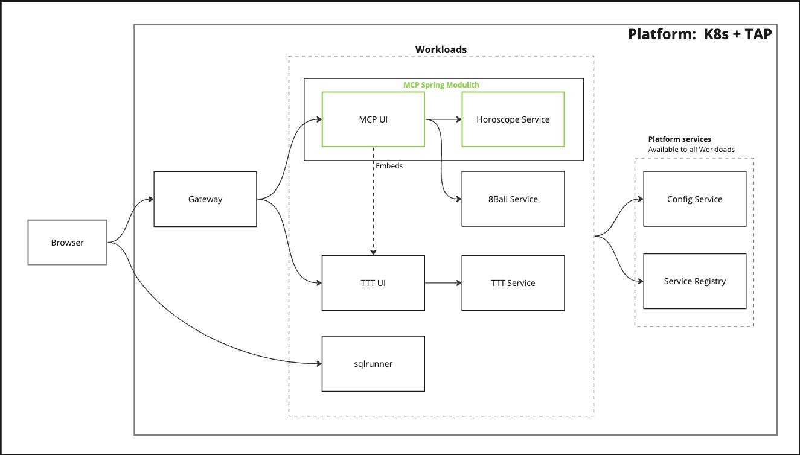

# MCP

The **Master Control Program**!!

The other applications in this suite can be run independently, but MCP is where they all come together (sort of).
Besides being an interesting app in and of itself (it's based off Spring Modulilth), it also is a hub for the other
apps.  It's also the place where I'll do the broad level documentation (starting here).

## Architcture

These are the apps in the demo suite and how they relate to each other.

[Miro board with architecture](https://miro.com/app/board/uXjVNWvnuFw=/#tpicker-content)

### Applications

All the applications run as Workloads on Tanzu Application Platform.

#### MCP

A UI and Service in a single application based on the Spring Modulith project/opinions.

##### UI

The MCP UI shows:

- The Oracle (retrieves data from Horoscope module)
- 8Ball (calls 8Ball Service)
- TTT (embeded)
- Link out to sqlrunner (maybe)

##### Horoscope

This module in MCP is basically a simple sentence generator.  It uses a data set that contains entries
for various pieces of grammer, and randomly builds a sentence (or 2 or 3).  The default data set is
for random horoscopes.

#### TTT

Tic Tac Toe.  Two parts.  A UI to interact with the user, and a Service that manages games.  There is
a UI that is embedable.

#### sqlrunner

Kotlin/Spring application that can be used to make queries to a database via JDBC.
